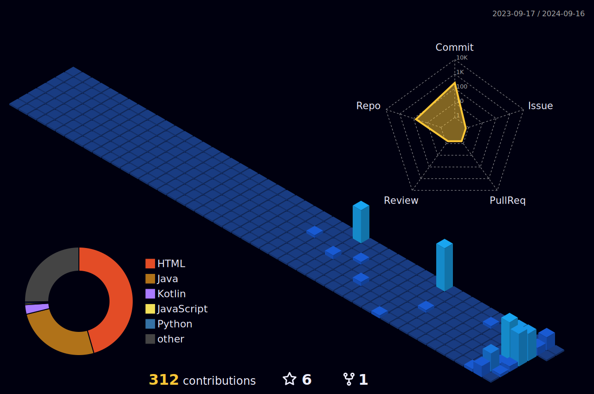

 

<h1 align="center">
    
</h1>

<picture>
  <source media="(prefers-color-scheme: dark)" srcset="https://raw.githubusercontent.com/CarolBicsi/CarolBicsi/output/github-contribution-grid-snake-dark.svg">
  <source media="(prefers-color-scheme: light)" srcset="https://raw.githubusercontent.com/CarolBicsi/CarolBicsi/output/github-contribution-grid-snake.svg">
  
</picture>

           

 
Know more

<!--   my-skils -->

| Property                                        | Data                                                                                                                                                                                                                                                                                                                                                                                                                                                                                                                                                                                                                                                                                                                                                                                                                                                                                                                                                                                                                                                                                                                                                                                                                                                                                                                                                                                                                                                                                                                                                                                                                                                                                                                                                                                                                                                                                                                                                                  |
|-------------------------------------------------|-----------------------------------------------------------------------------------------------------------------------------------------------------------------------------------------------------------------------------------------------------------------------------------------------------------------------------------------------------------------------------------------------------------------------------------------------------------------------------------------------------------------------------------------------------------------------------------------------------------------------------------------------------------------------------------------------------------------------------------------------------------------------------------------------------------------------------------------------------------------------------------------------------------------------------------------------------------------------------------------------------------------------------------------------------------------------------------------------------------------------------------------------------------------------------------------------------------------------------------------------------------------------------------------------------------------------------------------------------------------------------------------------------------------------------------------------------------------------------------------------------------------------------------------------------------------------------------------------------------------------------------------------------------------------------------------------------------------------------------------------------------------------------------------------------------------------------------------------------------------------------------------------------------------------------------------------------------------------|
| **Language / IDE**                              |     &nbsp; &nbsp; &nbsp; &nbsp;                                                                                                                                                                                                                                                                                                                                                                                                                                                                                                                                                                                                                                                                                                                                                                                                                                                                                                                                                                                                                                                                                                                                                                                                                                                                                                    |
| **Domain Knownledge**                           |                                                                                                                                                                                                                                                                                                                                                                                                                                                                                                                                                                                                                                                                                                                                                                                                                                                                                                                                                                                                                                                                                                                                                                                                                                                |
| **CI / CD**                                     |  &nbsp; &nbsp; &nbsp;    |
| **Databases**                                   | &nbsp; &nbsp;                                                                                                                                                                                                                                                                                                                                                                                                                                                                                                                                                                                                                                                                                                                                                                                                                                                                                                                                                                                                                                                                                                                                                                                                                                                                                                                                                                                                                                                                                                                                                                                                                                                                                                                                                                                                  |
| **Machine Learning / Deep Learning frameworks** | ![Jupyter Notebook](http://img.shields.io/badge/-Jupyter%20Notebook-eee?style=flat-square&logo=data:image/png;base64,iVBORw0KGgoAAAANSUhEUgAAAA4AAAAQCAMAAAARSr4IAAACGVBMVEVhYmJdYWT/fBfzdyaqdlV2dnfcdC9udnz5dyKUaU3wdicCO2CzZzVdUkpOTk5MTk60ZzUAAP/XcC3fcivgciv/lArAajLqdSifYjrydyajnJjEjWifnp3FjGcAAACenp52dnd2dnd2dndhYmJhYmIxW3bzdybzdybzdybzdybzdyb/dxpydnl2dnd2dndhYmJgYmOda0r0dyXzdybzdybzdybudymQdmZldoJQYGmRaU7ydyfzdybzdybzdybzdybzdybzdybzdyb1dyX9dx/2dyXzdybzdybzdyb+eiPzdybzdybzdyb/ghz8eSQ3SFT/tABNTk5HTFBMTk5OTk5OTk5OTk5OTk5OTk5OTk5OTk5OTk5NTk5GTFBOTk5OTk5OTk5OTk5OTk5OTk5OTk5OTk5OTk5OTk5OTk5OTk5OTk5OTk5OTk5NTk5OTk5OTk5OTk5OTk5OTk5OTk5OTk5OTk5NTk5NTk5UUEx5WUMAOGRMTU9OTk5OTk5OTk5OTk5OTk5FTFAXQFvBajK8aTP2eCX0dyb0dyb0dybzdyb4eCXzdybzdybzdybzdybzdybzdybzdybzdybzdyb6dB3zdyXzdybzdybzdybzdybzdybzdybzdyaenp6cn6HKimD0dyXzdybzdybzdybzdybzdybzdyaenp6enp6dn6Dzdybzdyaenp6enp6enp6enp7zdyaenp7///9F1GYlAAAAsHRSTlMAAAAAAAAAAAAAAAAAAAAAAAAAAAAAAAAAAAAAAAAAADHCVho4Ax1RcnFOFz/ibFmwHXPc/thwKwkKJpfbqn1oaX+uighRdSIDAyV6TAQcAgIVHBMbKjIgEzBTHCsbLUBdQlhiTWBlR1xkaEVIR1tPbFEvF0pJNR9AFAQIMwgfKQUDBwgDBEsuMkcCLLSUKBsqT5iwNcX47N/g7cAxPmUqZq/OzaxiExPJYgQPCJjcP9lVnrgAAAClSURBVAjXVcyxSoIBAEXh+xkhEkFr6hD0AM5BkbQ3ODaEY4uDSENCS1BThI/h4v4TERG0NzZHvoAQ0SDV8FvkmS6cw5UgSTR5s83rlgUvWuA8l/Bs59eYbXhS28VdUt1H4dA9Eu1HexUdS3T/7Y81vXJ9rQicLcxoAK64hvd1fWwOeDgoy+JW3bCs56tOonnxd3ycGKt9nt7I91GShgn60yRJI/kBP8EfEEdOa6sAAAAASUVORK5CYII=&logoColor=F37626)    &nbsp; &nbsp; |

[![My Skills](https://skillicons.dev/icons?i=ableton,activitypub,actix,adonis,ae,aiscript,alpinejs,anaconda,androidstudio,angular,ansible,apollo,apple,appwrite,arch,arduino,astro,atom,au,autocad,aws,azul,azure,babel,bash,bevy,bitbucket,blender,bootstrap,bsd,bun,c,cs,cpp,crystal,cassandra,clion,clojure,cloudflare,cmake,codepen,coffeescript,css,cypress,d3,dart,debian,deno,devto,discord,bots,discordjs,django,docker,dotnet,dynamodb,eclipse,elasticsearch,electron,elixir,elysia,emacs,ember,emotion,express,fastapi,fediverse,figma,firebase,flask,flutter,forth,fortran,gamemakerstudio,gatsby,gcp,git,github,githubactions,gitlab,gmail,gherkin,go,gradle,godot,grafana,graphql,gtk,gulp,haskell,haxe,haxeflixel,heroku,hibernate,html,htmx,idea,ai,instagram,ipfs,java,js,jenkins,jest,jquery,kafka,kali,kotlin,ktor,kubernetes,laravel,latex,less,linkedin,linux,lit,lua,md,mastodon,materialui,matlab,maven,mint,misskey,mongodb,mysql,neovim,nestjs,netlify,nextjs,nginx,nim,nix,nodejs,notion,npm,nuxtjs,obsidian,ocaml,octave,opencv,openshift,openstack,p5js,perl,ps,php,phpstorm,pinia,pkl,plan9,planetscale,pnpm,postgres,postman,powershell,pr,prisma,processing,prometheus,pug,pycharm,py,pytorch,qt,r,rabbitmq,rails,raspberrypi,react,reactivex,redhat,redis,redux,regex,remix,replit,rider,robloxstudio,rocket,rollupjs,ros,ruby,rust,sass,spring,sqlite,stackoverflow,styledcomponents,sublime,supabase,scala,sklearn,selenium,sentry,sequelize,sketchup,solidity,solidjs,svelte,svg,swift,symfony,tailwind,tauri,tensorflow,terraform,threejs,twitter,ts,ubuntu,unity,unreal,v,vala,vercel,vim,visualstudio,vite,vitest,vscode,vscodium,vue,vuetify,wasm)](https://skillicons.dev)

<!-- https://github.com/badges/shields -->

<!-- https://github.com/antonkomarev/github-profile-views-counter -->
  

<!--   GitHub stats graph -->
 📈 GitHub Activity Graph:

<!--   green snake -->

<!--   stats + languages -->
| .                                                                                                                                       | .                                                                                                                         |
|-----------------------------------------------------------------------------------------------------------------------------------------|---------------------------------------------------------------------------------------------------------------------------|
|  |  |

<!-- dark snake -->

### 社交媒体和平台监控

| 平台           | 监控链接                                                                 | 平台           | 监控链接                                                                 |
| -------------- | ------------------------------------------------------------------------ | -------------- | ------------------------------------------------------------------------ |
| GitHub         |  | B 站           |  |
| 掘金           |    | CSDN           |             |
| YouTube        |  | Vimeo          |  |
| Twitch         |  | Stack Overflow |  |
| Reddit         |  | Medium         |  |
| Hacker News    |  | GitHub         |  |
| GitLab         |  | Bitbucket      |  |
| 优酷           |  | 爱奇艺         |  |
| 腾讯视频       |  | 哔哩哔哩       |  |
| 掘金           |  | 知乎           |  |
| CSDN           |  | 简书           |  |
| 开源中国       |  | 码云           |  |

### 统计数据

| 统计类型       | 数据链接                                                                 |
| -------------- | ------------------------------------------------------------------------ |
| WakaTime 统计  |  |
| GitHub 连续提交 |  |
| GitHub 奖杯    |  |

#### Thanks for visiting :heart:

 
  

counting of visitors to this page in this section started from Sep 4, 2024

## Star History

